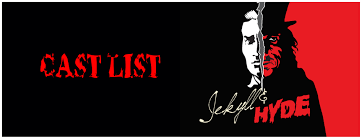

## Project Management Seminar
  
Christian H&ouml;rauf 
@fonzygruen

??HORIZONTAL
# Introduction
Note:
* Who am I ?

??VERTICAL
## Agenda Day 1
* Classical Project Management <!-- .element: class="fragment" -->
* Work in Groups: Stakeholder and Risk analysis <!-- .element: class="fragment" -->
* Exercise: Work Breakdown Structure / Precedence Diagram Method <!-- .element: class="fragment" -->
* Exercise: Milestone Trend Analysis <!-- .element: class="fragment" -->
Note:
* On day 1 we will examine the classical way of doing Project Management and evaluate some tools it provides to comprehend the expands of a project

??VERTICAL
## Agenda Day2
* Agile 
  * Agile Chair Game
  * Agile Coin Game
  * ...
* Scrum
* Lego Island Exercise

??VERTICAL
## Agenda Day3
* Kanban
* Sharpen Process Thinking Exercise

??VERTICAL
## Grades
* Exam <!-- .element: class="fragment" -->
* Student Research Project <!-- .element: class="fragment" -->
Note: 
The Exam will take place on 8th of February and I hope you will find enough hints in the next two days on how to prepare for it. Unfortunately I took over the seminar from another lecturer just a month ago. So there are no older tests with which you can prepare.

In the research project, you will be asked to plan a project. On saturday, I will give you five topics from which you pick one as a group of three or four. Each of you in the group will get the same grade for the research project.

Your final grade will depend for 2/3s on the Exam an 1/3 on the reserch project, which you will have to provide until ...

??HORIZONTAL
# Classic Project Management
Note:
Ask students what a Project is.
Definition: Undertaking that is distinguished by its uniqueness:
* novelty
* exceptionality
* complexity
* interdisciplinary

??VERTICAL
## The Magic Triangle
Note:
Project Success only by fulfilling the Magic Triangle
* Create panel with students 
  * Scope
  * Time
  * Cost

??VERTICAL
## Specification Booklet
* initial situation
* desired situation
* role definitions
* functional specifications
* non-functional specifications

??VERTICAL
## SMART Goals
* Specific <!-- .element: class="fragment" -->
* Measurable <!-- .element: class="fragment" -->
* Attractive <!-- .element: class="fragment" -->
* Reasonable <!-- .element: class="fragment" -->
* Time-bound <!-- .element: class="fragment" -->

Note:
* Specific means it should be clear what should be reached.
* Measurable means it should be possible to find out if the goals has been reached
* Attractive means it should be a goal that is obviously an improvement
* Reasonable means it should be realistic to reach that goal
* Time-bound means it should be reachable in a reasonable amount of time

??VERTICAL
## Bid
Note:
According to the specification booklet and the applicable law, the ProjectManager will provide a bid to the customer. In german PM you differentiate between the so called "Lastenheft" and the "Pflichtenheft". The first one contains mainly what the customer wants, where as the second one contains the plan, how you, the project holder, will fulfill that will. 

The documentation of this is seen as very important to solve legal questions, that might arise if the project finishes too late or the customer will not be satisfied by the project result.

??VERTICAL
# Planning

## Work Breakdown Structure

Note:

??HORIZONTAL
# Agile

Note:
Yesterday we examined classical Project Management. We talked about "Lastenheft" and "Pflichtenheft" and "Precedence Diagram Method". All these try to make the course of the project stable and predictable. And the mindset of it is, you need measure your own interests over those of your customer. If she or he might not be satisfied by the project result, it would be your task as project manager to find the fitting rhetoric to retune your customer. Maybe you will be successfull in this single case, but it is highly questionable if your customer will repeat business. Therefore you can see a new trend that came from IT-Industry and is taking over more and more companies.

The point is, the project work is very important. But you have to admit, that without your Team you can do nothing. And if you are not able to find a connection to your customer and to your team, the project result has always the risk of not fulfilling the required quality. and without quality your customer will never be satisfied.

??VERTICAL
## The magic route
* scope
* time
* budget
* quality

??VERTICAL
## The two souls of the ProjectManager

Note:
The classical Project Manager therefor has conflicting interests. She or he wants to fulfill the requirements of the customers which means to hold the time-bound. On the other hand the team might come to the conclusion, that it is not possible to hold the bound or only under overtime. 

??HORIZONTAL
# Scrum

??HORIZONTAL
# DAY 3
## Kanban

??VERTICAL
# Good Luck for the test